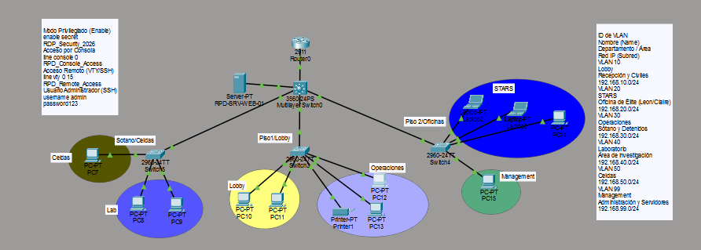

# 🚔 Raccoon Police Department (R.P.D.) Network Infrastructure

Proyecto de simulación de red corporativa utilizando **Cisco Packet Tracer**.

## 🚀 Características Técnicas
* **VLANs:** Segmentación de 6 departamentos (Lobby, STARS, Operaciones, Laboratorio, Celdas, Management).
* **Routing:** Inter-VLAN Routing (Router-on-a-Stick).
* **Servicios:** DHCP, DNS y Servidor Web Intranet.
* **Seguridad:** Listas de Control de Acceso (ACL), SSH y encriptación de contraseñas.

## 📸 Topología

## 🛠️ Cómo abrir el proyecto
1. Descarga el archivo `RPD_Project.pkt`.
2. Ábrelo con Cisco Packet Tracer (versión 8.x recomendada).nt.
